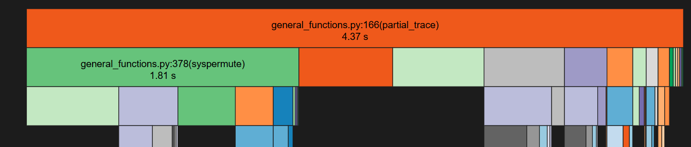
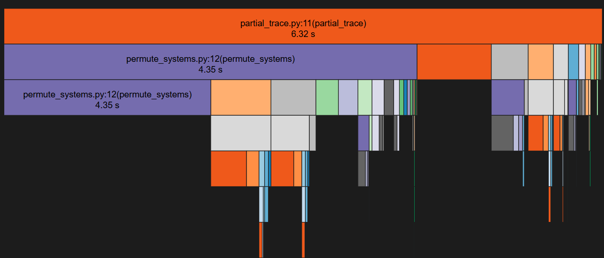

## Week 3 (16th June to 22nd June)

I resolved [this issue](https://github.com/vprusso/toqito-bench/issues/4) and benchmarked the `partial_trace` function from both `QuTiPy` and `toqito`. 

The initial write-ups and methodology can be found in [this comment](https://github.com/vprusso/toqito-bench/issues/4#issuecomment-2967868123).

Below are the results:

<html xmlns:v="urn:schemas-microsoft-com:vml"
xmlns:o="urn:schemas-microsoft-com:office:office"
xmlns:x="urn:schemas-microsoft-com:office:excel"
xmlns="http://www.w3.org/TR/REC-html40">

<head>

<meta name=ProgId content=Excel.Sheet>
<meta name=Generator content="Microsoft Excel 15">
<link id=Main-File rel=Main-File
href="file:///C:/Users/pravi/AppData/Local/Temp/msohtmlclip1/01/clip.htm">
<link rel=File-List
href="file:///C:/Users/pravi/AppData/Local/Temp/msohtmlclip1/01/clip_filelist.xml">

</head>

<body link="#0563C1" vlink="#954F72">

name | mean_toqito | mean_qutipy | ops_toqito | ops_qutipy | stddev_toqito | stddev_qutipy | min_toqito | min_qutipy | max_toqito | max_qutipy | median_toqito | median_qutipy | speedup_qutipy_over_toqito
-- | -- | -- | -- | -- | -- | -- | -- | -- | -- | -- | -- | -- | --
test_dim[None] | 6.93E-05 |   | 14437.41 |   | 2.21E-05 |   | 5.83E-05 |   | 0.000577 |   | 6.51E-05 |   |  
test_dim[[2, 2, 2, 2]] | 6.29E-05 | 1.69E-05 | 15898.14 | 59286.43 | 1.99E-05 | 6.20E-06 | 5.26E-05 | 1.36E-05 | 0.000591 | 0.000283 | 6.00E-05 | 1.59E-05 | 3.729141649
test_dim[[2, 2]] | 5.73E-05 | 1.59E-05 | 17464.87 | 62752.03 | 1.45E-05 | 5.78E-06 | 4.86E-05 | 1.27E-05 | 0.000529 | 0.000333 | 5.54E-05 | 1.51E-05 | 3.593042586
test_dim[[3, 3]] | 5.91E-05 | 1.61E-05 | 16922.01 | 62066.7 | 1.53E-05 | 5.04E-06 | 4.95E-05 | 1.26E-05 | 0.000418 | 0.000206 | 5.69E-05 | 1.56E-05 | 3.667808055
test_dim[[4, 4]] | 6.09E-05 | 1.62E-05 | 16409.67 | 61622.52 | 1.54E-05 | 6.33E-06 | 5.07E-05 | 1.31E-05 | 0.000451 | 0.000305 | 5.88E-05 | 1.56E-05 | 3.755257441
test_matrix_size[1024] | 0.0117496 | 0.005813617 | 85.10928 | 172.01 | 0.001007 | 0.000352 | 0.00958 | 0.005159 | 0.014142 | 0.006964 | 0.011807 | 0.005781 | 2.021048359
test_matrix_size[16] | 7.05E-05 | 1.55E-05 | 14180.98 | 64503.03 | 2.39E-05 | 6.07E-06 | 5.88E-05 | 1.26E-05 | 0.000541 | 0.000261 | 6.56E-05 | 1.48E-05 | 4.548559796
test_matrix_size[256] | 0.000742046 | 0.00054256 | 1347.626 | 1843.114 | 0.000105 | 5.31E-05 | 0.000658 | 0.000483 | 0.002417 | 0.001084 | 0.000719 | 0.000528 | 1.367675093
test_matrix_size[4] | 6.83E-05 | 1.59E-05 | 14649.75 | 62871.21 | 2.04E-05 | 7.38E-06 | 5.57E-05 | 1.22E-05 | 0.000448 | 0.000298 | 6.64E-05 | 1.54E-05 | 4.291624466
test_matrix_size[64] | 8.32E-05 | 1.79E-05 | 12017.07 | 55876.37 | 2.26E-05 | 8.78E-06 | 7.11E-05 | 1.49E-05 | 0.000599 | 0.000373 | 7.83E-05 | 1.67E-05 | 4.649749409
test_sys_param[[0, 1]] | 5.65E-05 | 1.48E-06 | 17705.06 | 675141.2 | 2.20E-05 | 1.01E-06 | 4.72E-05 | 1.17E-06 | 0.000643 | 9.88E-05 | 5.26E-05 | 1.46E-06 | 38.13266135
test_sys_param[[0, 2]] | 5.99E-05 | 1.89E-05 | 16703.22 | 52937.02 | 1.92E-05 | 9.46E-06 | 5.00E-05 | 1.45E-05 | 0.000756 | 0.000526 | 5.69E-05 | 1.77E-05 | 3.169270649
test_sys_param[[0]] | 6.92E-05 | 1.66E-05 | 14452.86 | 60388.85 | 1.93E-05 | 7.01E-06 | 5.89E-05 | 1.29E-05 | 0.00044 | 0.000354 | 6.52E-05 | 1.54E-05 | 4.1783312
test_sys_param[[1]] | 6.91E-05 | 1.85E-05 | 14481.11 | 53908.7 | 1.78E-05 | 6.32E-06 | 5.81E-05 | 1.37E-05 | 0.00053 | 0.000186 | 6.54E-05 | 1.73E-05 | 3.722691411

</body>

</html>

To compare performance, I calculated speedup using the ratio `mean_toqito / mean_qutipy`. Basic profiling revealed that in both implementations, the `permute_systems` function is the primary bottleneck, accounting for nearly half the total runtime.
For `QuTIPy`:

For `toqito`:

While profiling, I discovered that the check `is_vec = np.min(input_mat_dims) == 1` was a surprising bottleneck. Replacing it with a simpler condition — `input_mat_dims[0] == 1` or `input_mat_dims[1] == 1` — led to a significant speedup of over `20x` (roughly `27.5x` in some cases). Interestingly, I noticed that despite this local optimization, the total execution time occasionally increased, which is something I'm looking to investigate further. More details here: https://github.com/vprusso/toqito-bench/issues/
4#issuecomment-2974616275

We overcame the major bottleneck of identifying corresponding functions across libraries, which marked a significant breakthrough. The discussion can be found [here](https://github.com/vprusso/toqito-bench/issues/3#issuecomment-2988230881). Vincent and I finalized the list of benchmarking identifiers in [this comment](https://github.com/vprusso/toqito-bench/issues/3#issuecomment-2996203883).

The week concluded with the completion of benchmarks for the `channel_ops/` module in `toqito`.

